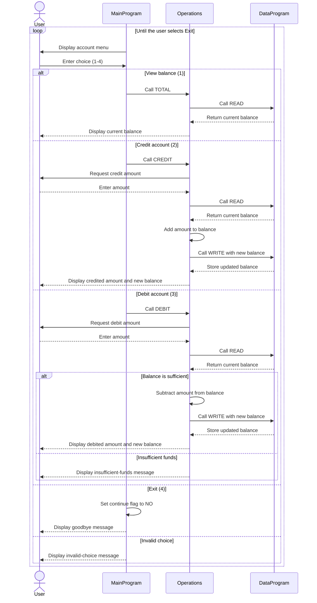

# Student Account COBOL Programs

This directory documents the COBOL student account application in `src/cobol`. The application is a console-based account management system that lets a user view a balance, credit an account, or debit an account.

## Program Overview

The programs use a simple separation of responsibilities:

- `main.cob` provides the interactive menu and translates the user's selection into an operation request.
- `operations.cob` implements account actions and applies the business rules for credits and debits.
- `data.cob` stores the account balance and provides read/write access to that balance.

The normal call flow is:

```text
MainProgram -> Operations -> DataProgram
```

`MainProgram` calls `Operations` with a six-character operation code. `Operations` calls `DataProgram` to read the current balance before displaying it or changing it.

## COBOL Files

### `src/cobol/main.cob`

**Program ID:** `MainProgram`

**Purpose:** Runs the user-facing account management menu.

**Key behavior:**

- Displays options to view the balance, credit the account, debit the account, or exit.
- Accepts a numeric choice from 1 through 4.
- Calls `Operations` with these operation codes:
  - `TOTAL ` for viewing the balance
  - `CREDIT` for adding funds
  - `DEBIT ` for removing funds
- Displays an error for any choice outside 1 through 4.
- Continues displaying the menu until the user selects option 4.

### `src/cobol/operations.cob`

**Program ID:** `Operations`

**Purpose:** Performs account operations requested by `MainProgram`.

**Key functions:**

- **View balance (`TOTAL `):** Reads the stored balance through `DataProgram` and displays it.
- **Credit (`CREDIT`):** Accepts an amount, reads the current balance, adds the amount, writes the new balance, and displays the result.
- **Debit (`DEBIT `):** Accepts an amount, reads the current balance, and subtracts the amount only when sufficient funds are available. A successful debit is written back and displayed; an unsuccessful debit displays an insufficient-funds message.

The program uses a six-character operation field, so the `TOTAL` and `DEBIT` operation names are passed with a trailing space to match the declared field size.

### `src/cobol/data.cob`

**Program ID:** `DataProgram`

**Purpose:** Provides the balance storage service used by `Operations`.

**Key functions:**

- **Read (`READ`):** Copies the stored balance into the caller-provided `BALANCE` field.
- **Write (`WRITE`):** Replaces the stored balance with the caller-provided `BALANCE` value.

The balance is held in working storage and starts at `1000.00`. The value is represented as a six-digit whole-number field with two decimal places (`PIC 9(6)V99`).

## Student Account Business Rules

- Each account starts with a balance of `1000.00` when `DataProgram` is initialized.
- A balance inquiry does not change the account balance.
- A credit increases the current balance by the amount entered.
- A debit is allowed only when the current balance is greater than or equal to the requested debit amount.
- A debit that exceeds the current balance is rejected and leaves the balance unchanged.
- Rejected debits display `Insufficient funds for this debit.`.
- Successful credits and debits persist the new balance through `DataProgram` and display the updated balance.
- The source does not define validation for negative, zero, non-numeric, or out-of-range amounts. Input handling for those cases is therefore outside the documented business rules and may require additional safeguards.
- The balance is stored in program working storage rather than an external database or file, so persistence is limited to the lifetime of the running program.

## Operation Codes

| Caller | Code | Meaning |
| --- | --- | --- |
| `MainProgram` -> `Operations` | `TOTAL ` | Display the current balance |
| `MainProgram` -> `Operations` | `CREDIT` | Add an entered amount |
| `MainProgram` -> `Operations` | `DEBIT ` | Subtract an entered amount when funds are sufficient |
| `Operations` -> `DataProgram` | `READ` | Retrieve the stored balance |
| `Operations` -> `DataProgram` | `WRITE` | Store an updated balance |

## Application Data Flow


